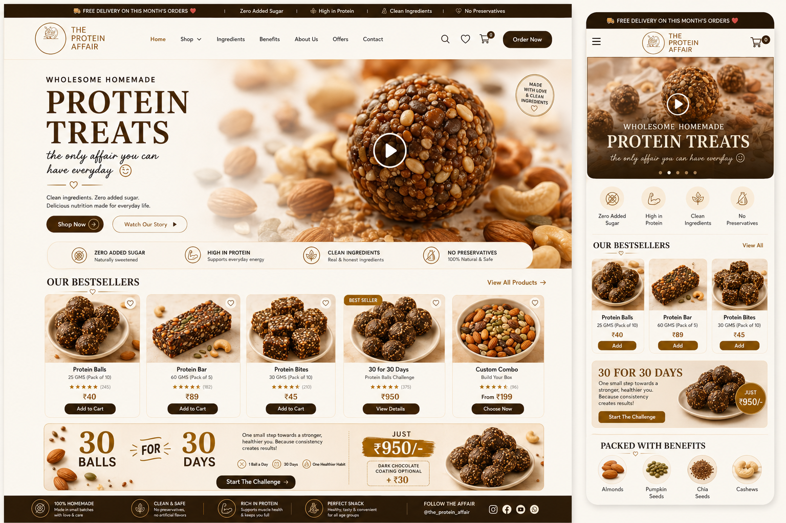

# The Protein Affair — E-commerce Website

A motion-rich, single-page e-commerce website for **The Protein Affair**, a homemade
protein-treats brand (protein balls, bars & bites). Built to match the brand's warm,
premium identity with a **video hero banner** and animated, interactive sections.



## Features

- 🎬 **Video hero banner** — the brand promo video autoplays (muted) in view, with a
  click-to-play overlay and a "Watch Our Story" lightbox for sound.
- 🛒 **Working cart** — add to cart, quantity controls, live subtotal, slide-out drawer,
  and cart contents persisted in `localStorage`.
- ✨ **Motion & interactions** — scrolling announcement + ingredient marquees, floating
  ingredient accents, scroll-reveal animations, rotating "made with love" badge, sticky
  header, hover micro-interactions, active-section nav highlighting, and a toast system.
- 🧱 **Full brand layout** — bestsellers grid, 30-for-30 challenge banner, "packed with
  benefits" superfoods grid, clean-ingredients marquee, brand story, and a rich footer.
- 🎨 **Crisp product art** — product tiles are drawn with inline SVG in the brand palette,
  so they stay sharp at any size (no pixelated crops).
- 📱 **Fully responsive** — desktop, tablet and mobile with a slide-in mobile menu.
- ♿ **Accessible** — semantic markup, keyboard (Esc closes overlays), and
  `prefers-reduced-motion` support.

## Tech

Pure **HTML + CSS + vanilla JavaScript** — no build step, no framework, no dependencies.

## Run it

Just open `index.html` in a browser, or serve the folder:

```bash
python3 -m http.server 8000
# then visit http://localhost:8000
```

## Structure

```
index.html              # markup for all sections
assets/
  css/style.css         # brand design system, layout, animations
  js/main.js            # products data, SVG art, cart, video & scroll logic
  media/
    hero.mp4            # video hero banner
    30for30.jpg         # video poster + campaign art
    menu.jpg            # brand story image
    design-desktop.png  # reference design
```

## Customising

- **Products** — edit the `products` array in `assets/js/main.js`.
- **Benefits / ingredients** — edit the `benefits` and `ingredients` arrays there too.
- **Colours & type** — CSS variables at the top of `assets/css/style.css`.
- **Contact** — phone `8667661387`, Instagram `@the_protein_affair`, FSSAI Lic. `22426390001​36`.
